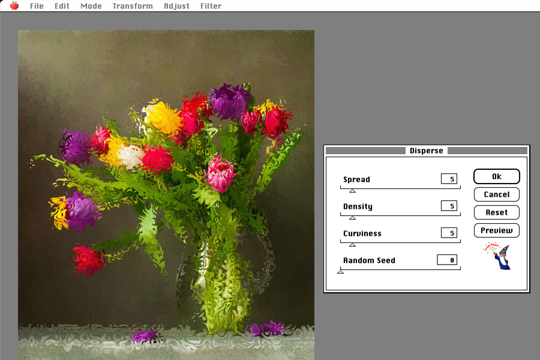
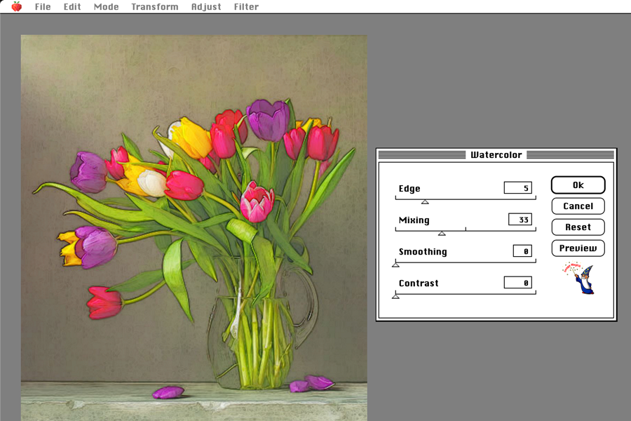
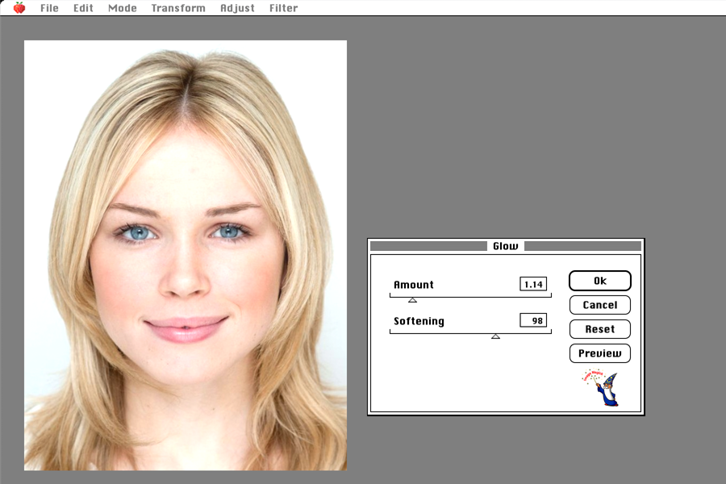

# Electric Cat

Electric Cat is an image processing software project, under development, implemented entirely in JavaScript, which mimics Photoshop 1.0 on Apple System 7, offering similar functionalities and interface. It's both a nod to Photoshop and to the Mac, and a study of what JS allows for image processing today (in 2018).

The software uses libraries and algorithms transcribed into JS from Gimp, ImageMagick and many other free software. Not everything is optimized yet, and some processing, depending on the parameters used, can take a lot of CPU time when they are not performed by the GPU with WebGL, discovered during the project.

At this stage of development (a hundred hours only), the software has only been tested on Google Chrome, on Macintosh. Thank you for using Chrome to test Electric Cat.

Handled image formats are PNG, JPG, WEBP and GIF (not animated).

It is possible to undo the last 20 actions using the Edit / Undo menu.

To open an image file, simply drag and drop it onto the gray area or use the File / Open menu.

~~No Zoom function is implemented at the moment, therefore choose a small image to test.~~

A minimal Zoom feature has finaly been implemented.

You can simply run it folowing this **DEMO LINK:** [ppyne.github.io/electriccat/](https://ppyne.github.io/electriccat/).

Normally, it should not be necessary to load the application through a web server; it should run locally, directly in your browser, by opening the file named "index.html" in Chrome. Be sure to have all the folders present in the project nearby.

Here is an ideal test image, save it on your computer, 

then drag and drop it on the gray area to open it, like this:

It is possible to carry out many treatments on an image, here are some eloquent examples.

## The transformations (transform menu)

Available features:

- Flip Horizontal
- Flip Vertical
- Rotate 180°
- Rotate 90° Clockwise
- Rotate 90° Counterclockwise
- Arbitrary Rotation...
- Resize... (thanks to Image Magick)
- Crop...

### Transform / Arbitrary Rotation...

### Transform / Resize...

### Transform / Crop...

## The adjustments (Adjust menu)

Available features:

- Levels... currently buggy (2022)
- Auto Levels (thanks to Image Magick)
- Auto Gamma (according to Fred Weinhaus, thanks to Image Magick)
- Brightness/Contrast...
- Auto Contrast (thanks to Image Magick)
- Sigmoidal Contrast... (thanks to Image Magick)
- Curves...
- Exposure... (according to Fred Weinhaus, thanks to Image Magick)
- Shadow and highlight... (according to Fred Weinhaus, thanks to Image Magick)
- Color Balance...
- Vibrance...
- Hue/Saturation...
- Hue Range Saturation... (according to Fred Weinhaus, thanks to Image Magick)
- Channel Mixer...
- Photo Filter...
- Invert
- Normalize
- Equalize
- Desaturate...
- Posterize...
- Threshold...
- Histogram...

### Adjust / Levels...

### Adjust / Curves...

### Adjust / Color Balance...

### Adjust / Channel Mixer...

### Adjust / Hue/Saturation...

With the colorize option:

### Adjust / Channel Mixer...

### Adjust / Photo Filter...

With all Kodak filters.

### Adjust / Desaturate...

### Adjust / Posterize...

## Les filters (Filter menu)

Available features:

- Blur
    - Blur
    - Blur More
    - Gaussian Blur...
    - Motion Blur...
    - Zoom Blur...
    - Lens Blur...
    - Tilt Shift...
    - Bilateral... (also known as Inner blur)
    - Triangle Blur...
    - Box Blur...
- Sharpen
    - Sharpen
    - Sharpen More
    - Unsharp Mask...
- Noise
    - Add Noise...
    - Median...
    - Despeckle
    - Denoise...
    - Bilateral... (also known as Inner blur)
- Pixelate
    - Pixelate...
    - Hexagonal Pixelate...
    - Halftone...
    - Crystallize... (according to Fred Weinhaus, thanks to Image Magick)
- Distort
    - Sine Distortion...
    - Pinch...
    - Twirl...
    - Disperse... (according to Fred Weinhaus, thanks to Image Magick)
    - Frosted... (according to Fred Weinhaus, thanks to Image Magick)
- Stylize
    - Sepia...
    - Vignette...
    - Charcoal... (thanks to Image Magick)
    - Sketch... (thanks to Image Magick)
    - Ink...
    - Watercolor... (according to Fred Weinhaus, thanks to Image Magick)
    - Painting...
    - Glow... (according to Fred Weinhaus, thanks to Image Magick)
    - Soft light... (according to Fred Weinhaus, thanks to Image Magick)
    - Dave Hill Effect... (according to Fred Weinhaus, thanks to Image Magick)
    - Lucis Art Effect... (according to Fred Weinhaus, thanks to Image Magick)
    - Morphology... (thanks to Image Magick)
    - Erosion...
    - Dialation...
    - Edge Work...
    - Difference of Gaussians...
    - Trace Contour
    - Find Edge
    - Find Edge IM (thanks to Image Magick)
    - Emboss Medium Gray
    - Emboss
    - Solarize
    - Pseudocolor

### Filter / Blur / Zoom Blur...

### Filter / Sharpen / Unsharp Mask...

### Filter / Noise / Median...

### Filter / Noise / Bilateral...

 Also known as inner blur.

### Filter / Pixelate / Hexagonal Pixelate...

### Filter / Pixelate / Halftone...

### Filter / Distort / Pinch...

### Filter / Distort / Twirl...

### Filter / Distort / Disperse...

### Filter / Stylize / Watercolor...

### Filter / Stylize / Glow...

### Filter / Stylize / Difference of Gaussians...

### Filter / Stylize / Solarize

## The modes (Mode menu)

Available features:
- Bitmap... (dither)
- Indexed Color... (quantize + dither)
- Grayscale
- RGB

### Mode / Bitmap...

### Mode / Indexed Color...

